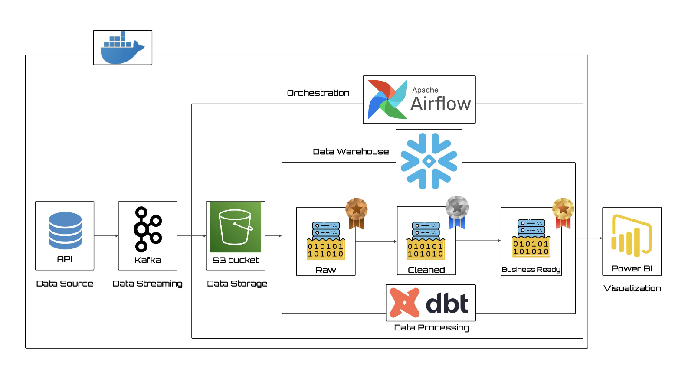

# Real-Time Stock Market Data Pipeline


An end-to-end real-time data engineering pipeline built with the Modern Data Stack. This project captures live stock market data from Finnhub API, streams it through Kafka, transforms it in Snowflake using DBT, and delivers analytics via Power BI dashboards.

🏗️ ## Architecture



The pipeline implements a medallion architecture (Bronze → Silver → Gold) with the following data flow:

1. **Ingestion**: Python producer fetches live stock data from Finnhub API
2. **Streaming**: Apache Kafka streams data in real-time with 3 partitions
3. **Storage**: Kafka consumer stores raw data in MinIO (S3-compatible storage)
4. **Orchestration**: Airflow DAG loads data from MinIO to Snowflake every minute
5. **Transformation**: DBT transforms data across Bronze, Silver, and Gold layers in Snowflake
6. **Visualization**: Power BI connects to Gold layer for interactive dashboards

🧰 ## Tech Stack

- **Data Source**: Finnhub API (live stock market data)
- **Streaming**: Apache Kafka + Zookeeper
- **Storage**: MinIO (S3-compatible object storage)
- **Orchestration**: Apache Airflow + PostgreSQL
- **Data Warehouse**: Snowflake
- **Transformation**: DBT (Data Build Tool)
- **Visualization**: Power BI
- **Language**: Python 3.8+
- **Deployment**: Docker + Docker Compose

🧠 ## Features

- ✅ Real-time stock market data streaming (not simulated)
- ✅ Fault-tolerant message processing with Kafka
- ✅ Automated ETL orchestration with Airflow
- ✅ Multi-layer data transformations (Bronze → Silver → Gold)
- ✅ Cloud-native data warehousing with Snowflake
- ✅ Interactive dashboards with candlestick charts, KPIs, and trend analysis
- ✅ Fully containerized architecture with Docker
- ✅ Scalable design with horizontal scaling capabilities

📂 ## Project Structure

```
real-time-stocks-pipeline/
├── infra/
│   └── docker-compose.yml          # Docker services configuration
├── producer/
│   └── producer.py                 # Kafka producer (Finnhub API)
├── consumer/
│   └── consumer.py                 # Kafka consumer (MinIO sink)
├── dbt_stocks/
│   └── models/
│       ├── bronze/                 # Raw staging layer
│       ├── silver/                 # Cleaned data layer
│       └── gold/                   # Analytics layer
├── dag/
│   └── minio_to_snowflake.py       # Airflow DAG
└── requirements.txt
```

🚀 ## Getting Started

### Prerequisites

- Docker Desktop
- Python 3.8+
- Snowflake account
- Finnhub API key (free tier available)

### Installation

1. Clone the repository
2. Set up virtual environment and install dependencies
3. Configure `docker-compose.yml` and start services
4. Initialize Airflow and create admin user
5. Create Kafka topic `stock_quotes` with 3 partitions
6. Set up Snowflake database, schema, and warehouse
7. Configure DBT with Snowflake credentials
8. Update producer script with Finnhub API key

### Running the Pipeline

1. **Start Producer**: Run `producer.py` to fetch and stream stock data
2. **Start Consumer**: Run `consumer.py` to consume and store data in MinIO
3. **Enable Airflow DAG**: Access Airflow UI and enable `minio_to_snowflake` DAG
4. **Run DBT**: Execute `dbt run` to create Bronze, Silver, and Gold tables
5. **Connect Power BI**: Link to Snowflake Gold layer and build dashboards

🪙 ## Data Layers

- 🥉 **Bronze**: Raw data as ingested from Kafka/MinIO
- 🥈 **Silver**: Cleaned, validated, and deduplicated data
- 🥇 **Gold**: Analytics-ready models (candlestick, KPIs, treechart)

🔌 ## Docker Services

| Service | Port | Description |
|---------|------|-------------|
| Kafka | 9092 | Message broker |
| Kafdrop | 9000 | Kafka UI |
| MinIO | 9001 | Object storage console |
| Airflow | 8080 | Workflow UI |
| PostgreSQL | 5432 | Airflow metadata |

🧑‍💻 ## Author

**Anushka Khadatkar**

---

❤️ Made with love for Data Engineering
